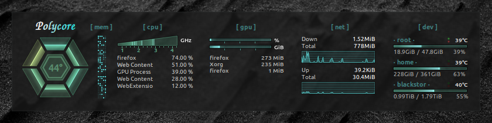

# polycore

**A conky config and library of Lua widgets**

## Features

* Stylish replacements for conky's default bars and graphs
* Allows complex layouts with minimal effort
* Minimal resource overhead through caching
* Easy to extend

## Requirements

* conky 1.10+ (with Lua and cairo support)
* basic understanding of conky and Lua
* *optional:* `lm_sensors` to display CPU core temperature and fan rpm
* *optional:* `nvidia-smi` to display NVIDIA video card stats
* *optional:* `hddtemp` to display hard drive temperature
* *optional:* `nvme-cli` to display NVMe drive temperature (experimental)

## Getting started

The `widget` module provides a number of basic and specialized modules
as well as grouping and rendering facilities. Their basic usage is best
understood by inspecting the `polycore.setup` function in `layout.lua`. Modifying this function is also the easiest way to get started. More examples can be found in [examples](examples).

You can either use a single-file setup (see [examples/columns.lua](examples/columns.lua)) or split the conky config and Widget layout into two files (see [conkyrc.lua](conkyrc.lua) and [layout.lua](layout.lua)).

*Wallpapers from pexels.com:
[1](https://www.pexels.com/photo/gray-mountain-2098403/),
[2](https://www.pexels.com/photo/photo-of-night-sky-1819650/),
[3](https://www.pexels.com/photo/green-leafed-trees-1144687/),
[4](https://www.pexels.com/photo/ocean-water-and-black-rock-formations-1590247/),
[5](https://www.pexels.com/photo/people-gathered-beside-bonfire-1368388/)
and [the one above](https://www.pexels.com/photo/black-and-white-photography-of-sand-2387819/)*

## Using Widgets

*See [philer.github.io/polycore/modules/widget.html](https://philer.github.io/polycore/modules/widget.html) for a full API reference.*

Widgets are rendered by a `widget.Renderer` instance and can have a cached background. A `widget.Group` or `widget.Columns` instance can serve as root of a complex layout of nested widgets. 
It makes sense to combine this with normal conky text rendering - in fact some Widgets (e.g. `widget.Network` and `widget.Drive`) assume this.

A widget can have fixed or flexible height and width. Fixed means that
the widget's `:init` function sets the `.width`/`.height` property to an integer.
If the respective property is not defined (`nil`) the layout engine
will assign an automatic amount of space, split evenly between this and other flexible widgets.

The following Widget classes are currently available:

* **`Widget`** the base class - Does nothing by itself.
* **`Group`** a container for multiple widgets to be rendered in a vertical stack - It is useful to subclass this in order to create compound widgets with a combined `:update()`.
* **`Columns`** like `Group` but horizontal
* **`Filler`** Leave some empty space. Can also wrap another widget to restrict its size.
* **`Frame`** Provides background color, border, padding and margin for other Widgets.
* **`Bar`** a basic bar similar to the one available in normal conky.
* **`MemoryBar`** a bar visualizing RAM usage.
* **`Graph`** a basic graph similar to the one available in normal conky.
* **`TextLine`** Display a dynamic line of text
* **`Cpu`** CPU-Usage indiciator in the form of a Polygon one segment per core - You guessed it, that's how this theme got its name.
* **`CpuFrequencies`** Bar-like indicator of frequencies for individual cores
* **`MemoryGrid`** visualization of used (and buffered/cached) RAM in a randomized grid
* **`Gpu`** Bars for GPU and VRAM usage - requires `nvidia-smi`
* **`GpuTop`** Show processes currently using the CPU.
* **`Network`** Graphs for up- and download speed - with space for conky.text in between.
* **`Drive`** Bar plus temperature indicator for a hard drive - requires hddtemp to be running and sudo access to nvme-cli for experimental NVME SSD support.

## Creating Widgets

In order to add your own Widget you should inherit the base class (`local MyWidget = util.class(widget.Widget)`). Look at `widget.lua` for examples.

The Widget API assumes the following functions. Note that only `:layout` is required.

* **`MyWidget:init(…)`** Your widget's constructor. It can set fixed `.width`/`.height` properties (see above).
* **`MyWidget:layout(width, height)`** This function will be called with arguments specifying the assigned space. If fixed `.width` and/or `.height` were specified the given arguments will be *at least* that value but may be greater.
*Note: For container Widgets this function must return a table of its children with relative coordinates and sizes. See the implementations of `Columns` and `Frame`.*
* **`MyWidget:render_background(cr)`** Allows you to draw some static background. This function will be called once at startup and again if the layout changes.
* **`MyWidget:update()`** Called once per update before `:render`. Here you can fetch new data to update the information visualized by your widget.
If your widget's size has changed this function should return `true` to trigger a layout reflow.
* **`MyWidget:render(cr)`** Allows you to draw dynamic content once per update.

You can also create composite Widgets by subclassing `Group` or `Columns`. See `Drive` as an example.
